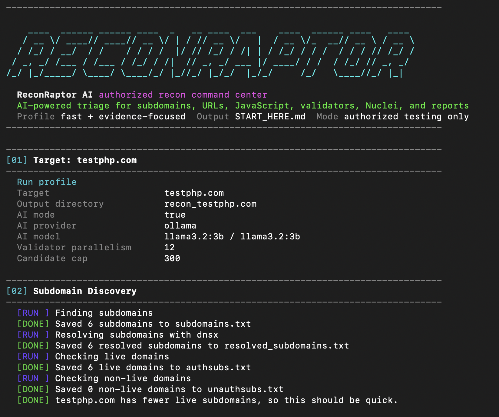

# ReconRaptor AI

[](LICENSE)
[](reconraptor.sh)
[](#ai-triage)
[](https://zuri09.github.io/ReconRaptor/)
[](#responsible-use)

ReconRaptor AI is a Bash reconnaissance workflow for bug bounty and approved security testing. It finds assets, collects URLs, analyzes JavaScript, validates high-signal leads, and writes reports that are easier to review than one giant folder of raw output.



```text
scope -> subdomains -> URLs -> JavaScript -> validators -> AI triage -> reports
```

## Why it exists

Recon tools are good at producing files. They are not always good at helping you decide what to open first.

ReconRaptor keeps discovery, candidates, findings, JavaScript analysis, ProjectDiscovery output, AI triage, and evidence in separate places. Open `START_HERE.md`, then drill into the report folder that matches what you want to review.

## What it does

| Area | What ReconRaptor handles |
| --- | --- |
| Asset discovery | `subfinder`, `dnsx`, `httpx` |
| URL collection | `waybackurls`, `katana`, sorting, filtering |
| JavaScript analysis | Live JS download, Gitleaks, built-in regex checks, source links |
| Secret reports | Generic key candidates and higher-confidence leak matches in separate JSON files |
| Validators | Exposed files, redirects, CORS, GraphQL, storage, takeover signals |
| ProjectDiscovery checks | Focused `nuclei` output and TLS metadata from `tlsx` |
| AI triage | Ollama, OpenAI, or offline scoring rules |
| Output UX | `START_HERE.md`, clean folders, report files, and evidence |

## Quick start

```bash
git clone https://github.com/Zuri09/ReconRaptor.git
cd ReconRaptor
chmod +x install.sh reconraptor.sh
./install.sh
./reconraptor.sh -d example.com
```

Run with local AI triage:

```bash
./install.sh --with-ollama
./reconraptor.sh -d example.com --ai --ai-provider ollama
```

Run with OpenAI triage:

```bash
OPENAI_API_KEY="your_api_key" ./reconraptor.sh -d example.com --ai --ai-provider openai
```

Send a zip of results to Discord:

```bash
./reconraptor.sh -d example.com -w "https://discord.com/api/webhooks/..."
```

## Installation

The installer checks for Go and installs the recon stack.

```bash
./install.sh
```

Skip the Nuclei template update if you are offline or want to keep your existing template cache untouched:

```bash
./install.sh --skip-nuclei-templates
```

Installed tools:

| Tool | Purpose |
| --- | --- |
| `subfinder` | Subdomain discovery |
| `dnsx` | DNS resolution |
| `httpx` | Live host probing and validation requests |
| `katana` | Live crawling |
| `nuclei` | Template-based checks |
| `tlsx` | TLS metadata |
| `subzy` | Subdomain takeover checks |
| `waybackurls` | Historical URL collection |
| `gitleaks` | Secret scanning |

Optional local AI setup:

```bash
./install.sh --with-ollama
```

Use a different Ollama model:

```bash
./install.sh --with-ollama --ollama-model llama3.1
```

If a Go-installed tool is not found after restarting your terminal, add this to your shell profile:

```bash
export PATH="$PATH:$(go env GOPATH)/bin"
```

## Usage

| Mode | Command |
| --- | --- |
| Standard scan | `./reconraptor.sh -d example.com` |
| Automatic AI provider | `./reconraptor.sh -d example.com --ai` |
| Local AI with Ollama | `./reconraptor.sh -d example.com --ai --ai-provider ollama` |
| Cloud AI with OpenAI | `OPENAI_API_KEY="your_api_key" ./reconraptor.sh -d example.com --ai --ai-provider openai` |
| Offline rules only | `./reconraptor.sh -d example.com --ai --ai-provider rules` |
| Custom Ollama model | `./reconraptor.sh -d example.com --ai --ai-provider ollama --ai-model llama3.2:3b` |

Tune validation speed:

```bash
MAX_VALIDATION_TARGETS=500 VALIDATOR_PARALLELISM=20 CURL_TIMEOUT=10 ./reconraptor.sh -d example.com
```

## AI triage

AI mode is optional. When you pass `--ai`, ReconRaptor builds a sanitized context file and creates a ranked triage report.

| File | Purpose |
| --- | --- |
| `reports/ai/ai_context.json` | Sanitized context passed to AI or local scoring |
| `reports/ai/ai_findings.json` | Ranked findings with severity, confidence, and next step |
| `reports/ai/ai_summary.md` | Human-readable triage report |
| `reports/ai/ai_ollama_response.json` | Raw Ollama response when using local AI |
| `reports/ai/ai_openai_response.json` | Raw OpenAI response when using OpenAI |

Provider behavior:

| Provider | Behavior |
| --- | --- |
| `auto` | Uses OpenAI if `OPENAI_API_KEY` is set, then Ollama if available, then local rules |
| `ollama` | Sends sanitized context to the local Ollama API |
| `openai` | Sends sanitized context to the OpenAI Responses API |
| `rules` | Scores findings locally and sends nothing outside the machine |

Environment variables:

| Variable | Default | Purpose |
| --- | --- | --- |
| `OPENAI_API_KEY` | unset | Required for OpenAI mode |
| `OPENAI_MODEL` | `gpt-5.6-luna` | OpenAI model for cloud triage |
| `OLLAMA_MODEL` | `llama3.2:3b` | Ollama model for local triage |
| `AI_MAX_FINDINGS` | `60` | Max findings included in AI context |

ReconRaptor strips secret-like query values, raw request and response bodies, downloaded JavaScript bodies, and long text before building `reports/ai/ai_context.json`. Treat scan output as sensitive anyway.

## Output structure

Each scan creates a target directory:

```text
recon_example.com/
|-- START_HERE.md
|-- raw/
|   |-- subdomains.txt
|   |-- resolved_subdomains.txt
|   |-- authsubs.txt
|   |-- unauthsubs.txt
|   |-- urls.txt
|   |-- js_files.txt
|   |-- json_files.txt
|   |-- authjs_files.txt
|   `-- authjson_files.txt
|-- reports/
|   |-- findings/
|   |   |-- confirmed_findings.json
|   |   |-- confirmed_findings_summary.txt
|   |   `-- subdomain_takeover_findings.json
|   |-- ai/
|   |   |-- ai_context.json
|   |   |-- ai_findings.json
|   |   `-- ai_summary.md
|   |-- urls/
|   |   |-- url_info_disclosure.txt
|   |   |-- smart_sensitive_files.json
|   |   `-- smart_secret_urls.json
|   |-- js/
|   |   |-- generic_api_keys.json
|   |   |-- genuine_leaks.json
|   |   |-- gitleaks_report.json
|   |   `-- js_vulnerability_findings.json
|   |-- pd/
|   |   |-- nuclei_findings.jsonl
|   |   |-- nuclei_auto_findings.jsonl
|   |   |-- nuclei_potential_url_findings.jsonl
|   |   `-- tls_findings.jsonl
|   `-- candidates/
|       |-- sensitive_file_candidates.txt
|       |-- open_redirect_candidates.txt
|       |-- cors_candidates.txt
|       |-- graphql_candidates.txt
|       `-- potential_vuln_urls.txt
`-- evidence/
    |-- downloaded_js/
    |-- downloaded_js_map.txt
    `-- validator_tmp/
```

Open `START_HERE.md` first.

| Folder | Best for |
| --- | --- |
| `reports/findings/` | Confirmed or high-confidence issues |
| `reports/ai/` | AI-ranked triage and sanitized model context |
| `reports/urls/` | URL disclosure leads and sensitive file matches |
| `reports/js/` | JavaScript secrets, Gitleaks output, and client-side indicators |
| `reports/pd/` | Nuclei and TLS output |
| `reports/candidates/` | Raw candidates checked by validators |
| `raw/` | Discovery data such as hosts, URLs, JS, and JSON |
| `evidence/` | Downloaded JavaScript and validator material |

## Confirmed validators

`reports/findings/confirmed_findings.json` is the main high-signal report.

| Validator | Confirmation logic |
| --- | --- |
| Exposed sensitive files | HTTP 200 plus sensitive path or config-like content |
| Open redirects | Controlled external URL appears in the `Location` header |
| CORS | Wildcard origin or reflected arbitrary origin with credentials |
| GraphQL | Introspection response or exposed GraphQL console |
| Cloud storage | Public readable object or bucket-like listing |
| Subdomain takeover | `subzy` vulnerable result, with Nuclei output retained separately |

## JavaScript analysis

ReconRaptor downloads live JavaScript files and scans them for:

- High-confidence secret patterns
- Generic API key candidates
- Cloud and SaaS indicators
- Source maps
- DOM XSS sinks and sources
- Client-side redirect indicators
- Sensitive browser storage usage
- Internal host references
- Admin, debug, API, and GraphQL paths

Main reports:

| Report | Purpose |
| --- | --- |
| `reports/js/generic_api_keys.json` | Broad API key and token candidates |
| `reports/js/genuine_leaks.json` | Higher-confidence built-in leak matches |
| `reports/js/gitleaks_report.json` | Gitleaks JSON output |
| `reports/js/js_vulnerability_findings.json` | Client-side vulnerability indicators |
| `reports/js/js_secret_summary.txt` | Summary counts and references |

## ProjectDiscovery checks

| Report | Source |
| --- | --- |
| `reports/pd/nuclei_findings.jsonl` | Curated Nuclei tag profile against live hosts |
| `reports/pd/nuclei_auto_findings.jsonl` | Nuclei automatic technology-mapped scan |
| `reports/pd/nuclei_potential_url_findings.jsonl` | Curated Nuclei tag profile against high-signal URLs |
| `reports/pd/tls_findings.jsonl` | TLS metadata from `tlsx` |

Nuclei runs with raw request and response output omitted.

ReconRaptor installs and updates the official ProjectDiscovery `nuclei-templates` set. The default profile focuses on tags that match ReconRaptor's own workflow:

```text
exposure, config, misconfig, default-login, unauth, takeover, graphql,
cors, redirect, swagger, openapi, panel, s3, bucket, aws, azure, google,
gstorage, token, secret, kev, vkev, cve
```

The script excludes noisy or unsafe template tags by default:

```text
intrusive, dos, fuzzing, creds-stuffing, login-check
```

Override the profile when needed:

```bash
NUCLEI_TEMPLATE_TAGS="exposure,misconfig,kev,vkev,cve" ./reconraptor.sh -d example.com
NUCLEI_AUTOMATIC_SCAN=false ./reconraptor.sh -d example.com
```

## Updating tools

```bash
go install -v github.com/projectdiscovery/subfinder/v2/cmd/subfinder@latest
go install -v github.com/projectdiscovery/dnsx/cmd/dnsx@latest
go install -v github.com/projectdiscovery/httpx/cmd/httpx@latest
go install -v github.com/projectdiscovery/katana/cmd/katana@latest
go install -v github.com/projectdiscovery/nuclei/v3/cmd/nuclei@latest
go install -v github.com/projectdiscovery/tlsx/cmd/tlsx@latest
go install -v github.com/PentestPad/subzy@latest
go install -v github.com/tomnomnom/waybackurls@latest
go install -v github.com/zricethezav/gitleaks/v8@latest
nuclei -update-templates
```

Update the default local AI model:

```bash
ollama pull llama3.2:3b
```

## Responsible use

Use ReconRaptor AI only on systems you own or are explicitly authorized to test. Scanner output and AI triage are leads, not proof by themselves. Reproduce findings manually, confirm scope, and report issues through the target's approved disclosure channel.

Scan output can contain sensitive data. Store reports carefully and avoid sharing raw results unless the program asks for them.

## License

ReconRaptor AI is released under the [MIT License](LICENSE).

## Author

Created by [Zuri09](https://github.com/Zuri09).
